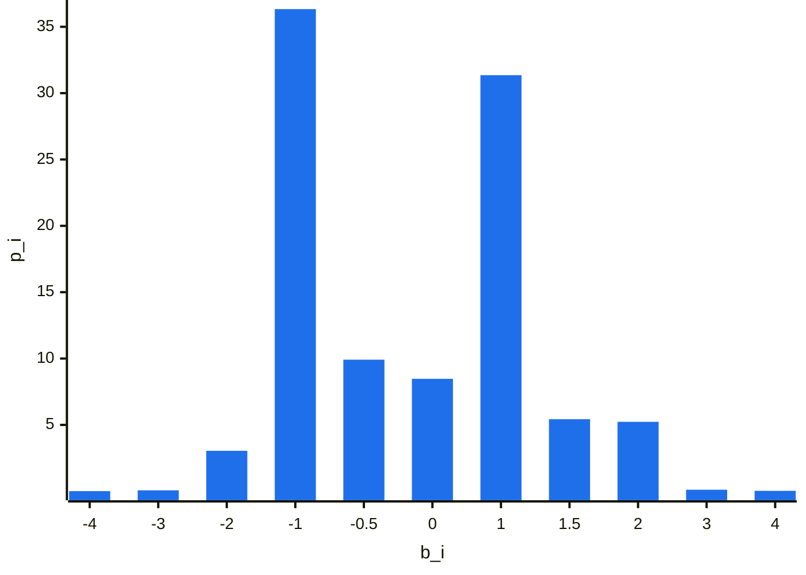

# Blackjack-Helper

## Description

This tool provides the optimal Blackjack strategy, guiding you on bet sizing and in-game decisions at every step.

## Install

### Build from source

```shell
mvn clean package
java -jar target/Blackjack-Helper-1.0.jar
```

### Download executable from [release](https://github.com/VincentPinet/Blackjack-Helper/releases)

[Direct link](https://github.com/VincentPinet/Blackjack-Helper/releases/download/v1.0/Blackjack-Helper-1.0.jar)

## Demo


0. Configurable rule variants (see table below)
1. Dealer's upcard
2. Discard tray
3. Player's hand
4. Splitting hand
5. Shoe composition (drag and drop to draw from)
6. EV of the shoe & Kelly criterion $`f^*`$ (see [Bankroll management](#bankroll-management))
7. Expected value in bet unit for each action
8. Shuffle the shoe
9. Play next hand

|  Rule Variants                                                 |
| :------------------------------------------------------------: |
| **S-17**    <br> *Stand on soft 17 (as opposed to hit)*        |
| **DAS**     <br> *Double after split*                          |
| **DOA**     <br> *Double on any 2 (as opposed to [9-11] only)* |
| **HSA**     <br> *Hit split aces*                              |
| **ES10**    <br> *Surrender against non ace*                   |
| **XD**      <br> *Number of decks in the shoe*                 |
| **BJ pays** <br> *Blackjack payout*                            |

> [!CAUTION]
> **ENHC** (European no hole card). The dealer does not peek at hole card!  

[//]: # ()

> [!WARNING]
> **NRS** (No re-split).

## Method

Purely a combinatorial analysis (fully composition dependent), meaning:

* no predefined strategy (i.e., basic chart)
* no abstraction of hands (i.e., hard 14, soft 15, ...)
* no abstraction of the shoe (i.e., counting)
* no abstraction of bets (i.e., bet spread)
* no simulation

## About Splitting

The EV of a split hand is determined independently of the other hand's cards.  
For example, splitting a pair of 8s is treated as twice the EV of starting a single hand with an 8, considering a shoe with one fewer 8. 

This approach avoids analyzing every possible two-card combination and subsequent adjustments in play for the second hand.  

Seems like a reasonable compromise given how computationally intensive it is for marginal precision improvements as shown by (Nairn J., 2019)[^1]  

> [!NOTE]
> This limitation only applies before clicking the split button when computing the overall expected value.  
> When navigating a specific instance of split hand in the application, both hands will have complete information.

## Bankroll management

Once we have established the optimal (according to maximizing EV metric), we can optimize our expected growth rate by looking at the resulting outcome distribution of this strategy and applying the generalized Kelly criterion.

For instance, in the rule and shoe configuration of the demo screenshot.  
We end up with the following discrete EV outcome distribution under optimal play:

| $`b_i`$ | -4      | -3      | -2      | -1       | -0.5    | 0       | 1       | 1.5      | 2       | 3       | 4       |
| :---:   | :---------: | :---------: | :---------: | :----------: | :---------: | :---------: | :---------: | :----------: | :---------: | :---------: | :---------: |
| $`p_i`$ | .009\% | .068\% | 3.046\% | 36.333\% | 9.913\% | 8.472\% | 31.353\% | 5.427\% | 5.231\% | .113\% | .031\% |



We can then find $`x`$ the optimal fraction  of our bankroll to wager that maximizes the expected growth rate, defined as:  
$`g(x)=\sum_{i}(p_i*log(1+b_i*x))`$  

```mermaid
---
config:
    themeVariables:
        xyChart:
            backgroundColor: " #00000000"
            plotColorPalette: " #1f6feb, #ffffff"
    xyChart:
        yAxis:
            showLabel: false

---
xychart-beta
    y-axis "g(x)"
    x-axis "% of bankroll to wager" -0.2 --> 4.99
    line [-0.00583584, -0.00553285, -0.00523104, -0.00493041, -0.00463096, -0.00433269, -0.00403559, -0.00373968, -0.00344494, -0.00315138, -0.002859, -0.0025678, -0.00227778, -0.00198893, -0.00170126, -0.00141478, -0.00112946, -0.000845332, -0.000562377, -0.000280599, 0, 0.000279422, 0.000557666, 0.000834732, 0.00111062, 0.00138533, 0.00165887, 0.00193122, 0.0022024, 0.00247241, 0.00274123, 0.00300888, 0.00327535, 0.00354064, 0.00380476, 0.0040677, 0.00432947, 0.00459005, 0.00484946, 0.0051077, 0.00536475, 0.00562064, 0.00587534, 0.00612887, 0.00638122, 0.0066324, 0.00688239, 0.00713122, 0.00737887, 0.00762534, 0.00787063, 0.00811475, 0.0083577, 0.00859946, 0.00884006, 0.00907947, 0.00931771, 0.00955478, 0.00979067, 0.0100254, 0.0102589, 0.0104913, 0.0107225, 0.0109525, 0.0111813, 0.011409, 0.0116355, 0.0118608, 0.0120849, 0.0123079, 0.0125297, 0.0127503, 0.0129697, 0.013188, 0.0134051, 0.013621, 0.0138358, 0.0140493, 0.0142617, 0.0144729, 0.014683, 0.0148919, 0.0150996, 0.0153061, 0.0155114, 0.0157156, 0.0159186, 0.0161204, 0.0163211, 0.0165206, 0.0167189, 0.016916, 0.017112, 0.0173068, 0.0175004, 0.0176928, 0.0178841, 0.0180742, 0.0182631, 0.0184508, 0.0186374, 0.0188228, 0.019007, 0.0191901, 0.019372, 0.0195527, 0.0197322, 0.0199106, 0.0200878, 0.0202638, 0.0204386, 0.0206123, 0.0207848, 0.0209561, 0.0211263, 0.0212953, 0.0214631, 0.0216297, 0.0217952, 0.0219595, 0.0221226, 0.0222846, 0.0224453, 0.022605, 0.0227634, 0.0229207, 0.0230767, 0.0232317, 0.0233854, 0.023538, 0.0236894, 0.0238396, 0.0239887, 0.0241366, 0.0242833, 0.0244288, 0.0245732, 0.0247164, 0.0248585, 0.0249993, 0.025139, 0.0252775, 0.0254149, 0.0255511, 0.0256861, 0.0258199, 0.0259526, 0.0260841, 0.0262144, 0.0263435, 0.0264715, 0.0265983, 0.026724, 0.0268485, 0.0269718, 0.0270939, 0.0272148, 0.0273346, 0.0274533, 0.0275707, 0.027687, 0.0278021, 0.027916, 0.0280288, 0.0281404, 0.0282508, 0.0283601, 0.0284682, 0.0285751, 0.0286808, 0.0287854, 0.0288888, 0.0289911, 0.0290921, 0.029192, 0.0292908, 0.0293883, 0.0294847, 0.0295799, 0.029674, 0.0297669, 0.0298586, 0.0299491, 0.0300385, 0.0301267, 0.0302138, 0.0302996, 0.0303843, 0.0304679, 0.0305502, 0.0306314, 0.0307114, 0.0307903, 0.030868, 0.0309445, 0.0310198, 0.031094, 0.031167, 0.0312389, 0.0313096, 0.0313791, 0.0314474, 0.0315146, 0.0315806, 0.0316454, 0.0317091, 0.0317715, 0.0318329, 0.031893, 0.031952, 0.0320098, 0.0320665, 0.032122, 0.0321763, 0.0322294, 0.0322814, 0.0323322, 0.0323819, 0.0324304, 0.0324777, 0.0325238, 0.0325688, 0.0326126, 0.0326552, 0.0326967, 0.032737, 0.0327761, 0.0328141, 0.0328509, 0.0328865, 0.032921, 0.0329543, 0.0329864, 0.0330174, 0.0330472, 0.0330758, 0.0331033, 0.0331296, 0.0331547, 0.0331786, 0.0332014, 0.0332231, 0.0332435, 0.0332628, 0.0332809, 0.0332979, 0.0333137, 0.0333283, 0.0333417, 0.033354, 0.0333652, 0.0333751, 0.0333839, 0.0333915, 0.033398, 0.0334033, 0.0334074, 0.0334103, 0.0334121, 0.0334127, 0.0334122, 0.0334105, 0.0334076, 0.0334036, 0.0333983, 0.033392, 0.0333844, 0.0333757, 0.0333658, 0.0333548, 0.0333426, 0.0333292, 0.0333147, 0.0332989, 0.0332821, 0.033264, 0.0332448, 0.0332244, 0.0332029, 0.0331802, 0.0331563, 0.0331313, 0.0331051, 0.0330777, 0.0330492, 0.0330195, 0.0329886, 0.0329566, 0.0329234, 0.032889, 0.0328535, 0.0328168, 0.0327789, 0.0327399, 0.0326997, 0.0326583, 0.0326158, 0.0325721, 0.0325273, 0.0324812, 0.0324341, 0.0323857, 0.0323362, 0.0322855, 0.0322337, 0.0321806, 0.0321265, 0.0320711, 0.0320146, 0.0319569, 0.0318981, 0.0318381, 0.0317769, 0.0317146, 0.0316511, 0.0315864, 0.0315206, 0.0314536, 0.0313854, 0.0313161, 0.0312456, 0.0311739, 0.0311011, 0.0310271, 0.030952, 0.0308756, 0.0307981, 0.0307195, 0.0306397, 0.0305587, 0.0304766, 0.0303933, 0.0303088, 0.0302231, 0.0301363, 0.0300484, 0.0299592, 0.0298689, 0.0297775, 0.0296849, 0.0295911, 0.0294961, 0.0294, 0.0293027, 0.0292042, 0.0291046, 0.0290038, 0.0289019, 0.0287988, 0.0286945, 0.0285891, 0.0284825, 0.0283747, 0.0282658, 0.0281557, 0.0280444, 0.027932, 0.0278184, 0.0277036, 0.0275877, 0.0274706, 0.0273524, 0.027233, 0.0271124, 0.0269907, 0.0268678, 0.0267437, 0.0266185, 0.0264921, 0.0263645, 0.0262358, 0.0261059, 0.0259748, 0.0258426, 0.0257092, 0.0255747, 0.025439, 0.0253021, 0.025164, 0.0250248, 0.0248845, 0.0247429, 0.0246002, 0.0244564, 0.0243113, 0.0241652, 0.0240178, 0.0238693, 0.0237196, 0.0235688, 0.0234167, 0.0232636, 0.0231092, 0.0229537, 0.0227971, 0.0226392, 0.0224802, 0.0223201, 0.0221587, 0.0219963, 0.0218326, 0.0216678, 0.0215018, 0.0213347, 0.0211664, 0.0209969, 0.0208263, 0.0206545, 0.0204815, 0.0203074, 0.0201321, 0.0199556, 0.019778, 0.0195992, 0.0194193, 0.0192382, 0.0190559, 0.0188725, 0.0186879, 0.0185021, 0.0183152, 0.0181271, 0.0179378, 0.0177474, 0.0175558, 0.0173631, 0.0171692, 0.0169741, 0.0167778, 0.0165804, 0.0163819, 0.0161821, 0.0159812, 0.0157792, 0.015576, 0.0153716, 0.015166, 0.0149593, 0.0147514, 0.0145424, 0.0143322, 0.0141208, 0.0139083, 0.0136946, 0.0134797, 0.0132637, 0.0130465, 0.0128282, 0.0126086, 0.012388, 0.0121661, 0.0119431, 0.011719, 0.0114936, 0.0112671, 0.0110395, 0.0108106, 0.0105806, 0.0103495, 0.0101172, 0.00988369, 0.00964905, 0.00941324, 0.00917627, 0.00893814, 0.00869884, 0.00845837, 0.00821675, 0.00797396, 0.00773, 0.00748488, 0.0072386, 0.00699116, 0.00674255, 0.00649278, 0.00624184, 0.00598974, 0.00573647, 0.00548205, 0.00522645, 0.0049697, 0.00471178, 0.0044527, 0.00419245, 0.00393104, 0.00366846, 0.00340473, 0.00313982, 0.00287376, 0.00260653, 0.00233813, 0.00206858, 0.00179785, 0.00152597, 0.00125292, 0.000978706, 0.00070333, 0.000426789, 0.000149084, -0.000129784, -0.000409817, -0.000691013, -0.000973374, -0.0012569, -0.00154159, -0.00182744, -0.00211445, -0.00240263, -0.00269198, -0.00298249, -0.00327416, -0.00356699, -0.00386099, -0.00415616, -0.00445248, -0.00474998, -0.00504863, -0.00534845, -0.00564944, -0.00595158] 
    line [0,0]
```

Our function is concave we can get the maximum by finding the root of the derivative of $g$  
We land back on our Kelly criterion $`f^*=2.39\%`$ of the demo screenshot.

## Side Note

What if there is a strategy that is not entirely based on maximizing EV but takes into account lowering the volatility to some degree, in the hope that it will allow bigger bet sizes that ultimately improves the growth rate?  

It has been shown on Video poker by Shackleford[^2]. However, in Blackjack, it's unlikely that we would be able to raise bet sizes significantly enough to recoup the immediate EV loss of a suboptimal strategy.

## Disclaimer

Gambling involves risk.

[^1]: [https://arxiv.org/pdf/1909.13710](https://arxiv.org/pdf/1909.13710)
[^2]: [https://wizardofodds.com/ask-the-wizard/196/](https://wizardofodds.com/ask-the-wizard/196/)
